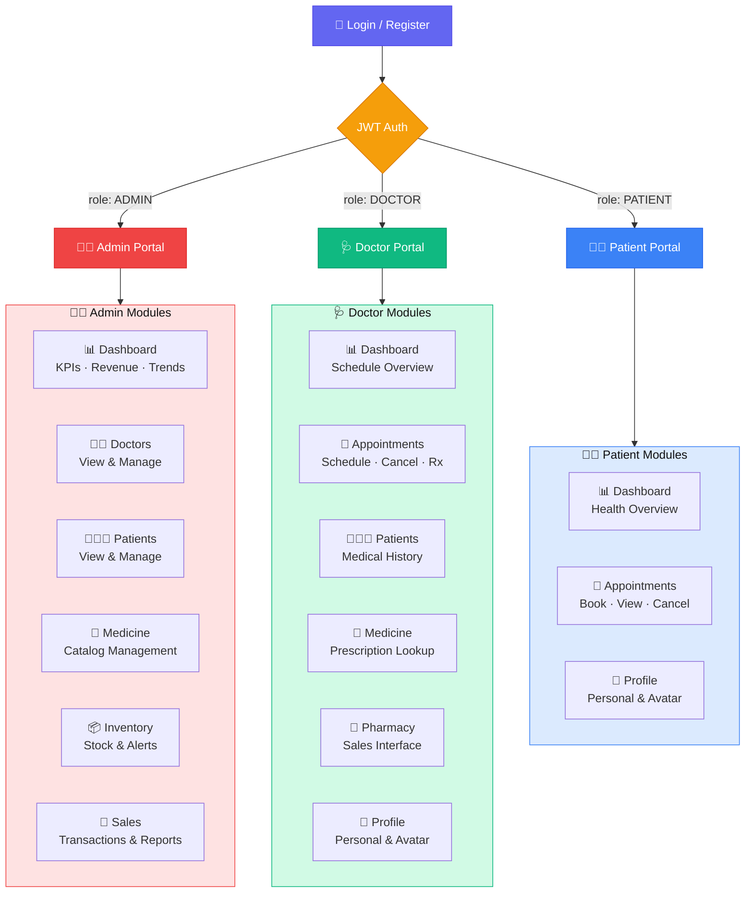
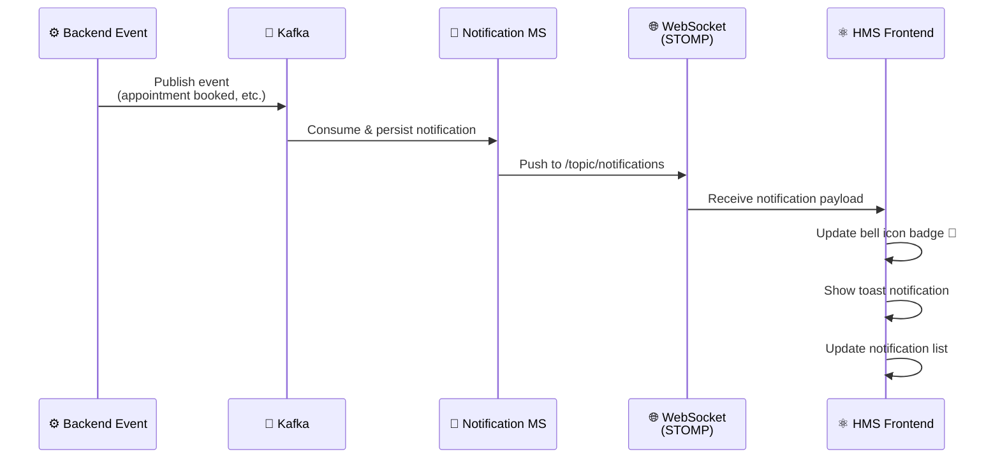
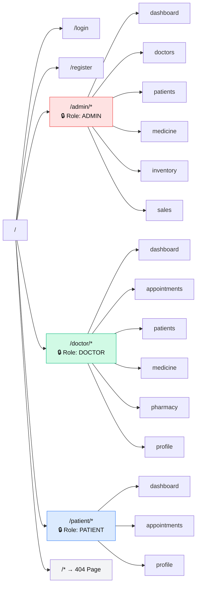

# 🏥 HMS Frontend — Hospital Management System

<div align="center">


**A modern, role-based Hospital Management System frontend**  
Built with React 19 · TypeScript · Mantine UI · Redux Toolkit · WebSocket Notifications

[🔗 Backend Repository](https://github.com/Leyla-la/hms-backend) · [📖 API Docs](http://localhost:9000/user/swagger-ui/index.html)

</div>

---

## 🗺️ Role-Based Application Map



---

## 🔔 Real-Time Notification Flow



---

## ✨ Features by Role

### 👨‍💼 Admin
| Feature | Description |
|---------|-------------|
| 📊 Dashboard | Live KPI cards — Revenue, Total Patients, Doctors, Appointments |
| 📈 Analytics | Appointment trends chart, Inventory health, Top medicines/patients |
| 🔔 Live Alerts | Real-time notifications via WebSocket |
| 👨‍⚕️ Doctors | Full doctor management with profile details |
| 🧑‍🤝‍🧑 Patients | Patient list with appointment history |
| 💊 Medicine | Medicine catalog CRUD |
| 📦 Inventory | Stock management with low-stock alerts |
| 🛒 Sales | Sales records, prescription-linked transactions |

### 🩺 Doctor
| Feature | Description |
|---------|-------------|
| 📅 Appointments | View scheduled appointments, write clinical records |
| 📝 Prescriptions | Issue prescriptions linked to appointments |
| 📋 Medical History | View patient's complete appointment history (COMPLETED only) |
| 🧑‍🤝‍🧑 Patients | View patient profiles from their appointments |
| 💊 Medicine | Lookup medicine catalog for prescription guidance |
| 🏪 Pharmacy | Access pharmacy sales linked to their prescriptions |
| 🖼️ Avatar | Upload & update profile picture |

### 🧑‍⚕️ Patient
| Feature | Description |
|---------|-------------|
| 📅 Appointments | Book new appointments, view upcoming & past |
| ❌ Cancel | Cancel upcoming appointments with confirmation |
| 📊 Dashboard | Personal health overview — upcoming visits, history count |
| 🖼️ Avatar | Upload & update profile picture |

---

## 🚀 Getting Started

### Prerequisites

- Node.js 20+
- npm 9+
- Running HMS Backend (see [Backend README](https://github.com/Leyla-la/hms-backend))

---

### 💻 Run Locally

```bash
# 1. Clone
git clone https://github.com/Leyla-la/hms-frontend.git
cd hms-frontend

# 2. Install dependencies
npm install

# 3. Create environment file
cp .env.backup .env
# Edit .env.local with your backend URL if different from localhost

# 4. Start development server
npm start
```

App runs at: **http://localhost:3000**

> Make sure the backend API Gateway is running at `http://localhost:9000`

---

### 🐳 Run with Docker

```bash
# 1. Build production bundle
npm run build

# 2. Build Docker image
docker build -t hms-frontend .

# 3. Run container
docker run -d -p 80:80 --name hms-web hms-frontend
```

App accessible at: **http://localhost**

---

## 🌱 Environment Configuration

| Variable | Default | Description |
|----------|---------|-------------|
| `REACT_APP_API_URL` | `http://localhost:9000` | API Gateway base URL |
| `REACT_APP_WS_URL` | `ws://localhost:9000/ws` | WebSocket endpoint |
| `REACT_APP_MEDIA_URL` | `http://localhost:9400` | Media service base URL |

---

## 🗂️ Project Structure

```
src/
├── 📁 Components/
│   ├── Admin/          # Admin-specific pages (Dashboard, Doctors, Sales...)
│   ├── Doctor/         # Doctor-specific pages (Appointments, Patients...)
│   ├── Patient/        # Patient-specific pages
│   ├── Common/         # Shared components (PageHeader)
│   ├── Dashboard/      # Reusable dashboard widgets (KpiCard, Charts...)
│   ├── Header/         # Top navigation + Notifications bell
│   ├── Sidebar/        # Role-based sidebar navigation
│   └── Utility/        # AvatarUploadModal, ProfileAvatar, Dropzone
│
├── 📁 Pages/
│   ├── Admin/          # Page wrappers for Admin routes
│   ├── Doctor/         # Page wrappers for Doctor routes
│   └── Patient/        # Page wrappers for Patient routes
│
├── 📁 Service/
│   ├── UserService.tsx
│   ├── AppointmentService.tsx
│   ├── DashboardService.tsx
│   ├── MedicineService.tsx
│   ├── InventoryService.tsx
│   ├── SalesService.tsx
│   ├── MediaService.tsx
│   ├── NotificationService.tsx
│   └── StompClient.tsx       # WebSocket STOMP setup
│
├── 📁 Slices/          # Redux state slices (Auth, Profile)
├── 📁 Utility/         # AuthBootstrap, PrescriptionUtil, Store
├── 📁 Interceptor/     # AxiosInterceptor (JWT injection)
├── 📁 Routes/          # AppRoutes (protected, role-based)
├── 📁 hooks/           # useNotifications (WebSocket hook)
└── 📁 Utils/           # DataUtils (formatting helpers)
```

---

## ⚙️ Tech Stack

| Category | Technology |
|----------|-----------|
| Framework | React 19 |
| Language | TypeScript 5 |
| State Management | Redux Toolkit 2 + React Redux |
| UI Component Library | **Mantine UI 8** (Core, Forms, Modals, Notifications) |
| Icons | Tabler Icons React |
| HTTP Client | Axios 1 + Interceptor |
| Routing | React Router DOM 7 |
| WebSocket | STOMP over SockJS |
| JWT | jwt-decode |
| Date Handling | Day.js |
| Phone Input | react-phone-number-input |
| Build Tool | Create React App (react-scripts) |
| Production Server | Nginx (via Docker) |

---

## 🧭 Routing Structure



---

## 🤝 Contributing

```bash
# Create feature branch
git checkout -b feat/your-feature

# Commit using Conventional Commits
git commit -m "feat(scope): your description"

# Push to remote
git push origin feat/your-feature
```

**Branch conventions:** `feat/` · `fix/` · `refactor/` · `chore/`

---

<div align="center">

Built with ❤️ · React · TypeScript · Mantine UI · Real-time WebSocket

</div>
